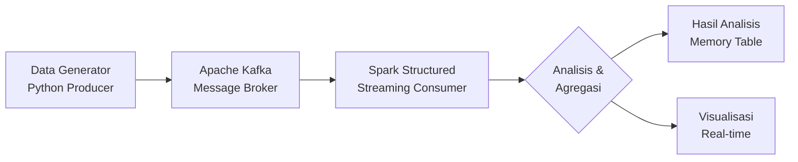

# BIG-DATA-PRAKTIKUM-7

# 🚀 Streaming Analytics dengan Kafka & Spark di Google Colab


**Praktikum Lengkap: Real-time Data Processing dengan Apache Kafka dan Spark Structured Streaming**

## 📋 Daftar Isi
- [🎯 Tujuan Praktikum](#-tujuan-praktikum)
- [🏗️ Arsitektur Sistem](#️-arsitektur-sistem)
- [📁 Struktur Kode](#-struktur-kode)
- [🔧 Instalasi & Setup](#-instalasi--setup)
- [📊 Analisis yang Dihasilkan](#-analisis-yang-dihasilkan)
- [🧪 Tugas Praktikum](#-tugas-praktikum)
- [❓ Troubleshooting](#-troubleshooting)

## 🎯 Tujuan Praktikum

1. **Menyiapkan lingkungan Big Data** (Spark & Kafka) di Google Colab
2. **Memahami cara mengirim data streaming** ke Kafka (Producer)
3. **Mampu memproses data real-time** menggunakan Spark Structured Streaming (Consumer)
4. **Melakukan analisis agregasi** pada data streaming
5. **Mengimplementasikan filter dan transformasi** data

## 🏗️ Arsitektur Sistem



## 📁 Struktur Kode
```python
# BAGIAN 1: PERSIAPAN LINGKUNGAN
!apt-get install openjdk-8-jdk  # Install Java
!wget https://archive.apache.org/dist/kafka/3.6.0/kafka_2.12-3.6.0.tgz  # Download Kafka
!wget https://archive.apache.org/dist/spark/spark-3.5.0/spark-3.5.0-bin-hadoop3.tgz  # Download Spark

# BAGIAN 2: KAFKA PRODUCER
from kafka import KafkaProducer
import json
import random

# BAGIAN 3: SPARK STREAMING
from pyspark.sql import SparkSession
from pyspark.sql.functions import *

# BAGIAN 4: MONITORING
query = df_analysis.writeStream \
    .outputMode("complete") \
    .format("memory") \
    .queryName("sales_table") \
    .start()

```
## 🔧 Instalasi & Setup
Dependensi yang Diinstal:
✅ Java 8 (untuk Spark & Kafka)

✅ Apache Kafka 3.6.0

✅ Apache Spark 3.5.0

✅ Python Libraries: kafka-python, findspark

Services yang Dijalankan:
Zookeeper (port 2181) - untuk koordinasi Kafka

Kafka Broker (port 9092) - message broker

Spark Session - untuk pemrosesan data

Topik Kafka yang Dibuat:
Nama: transaksi-toko

Partitions: 1

Replication: 1
