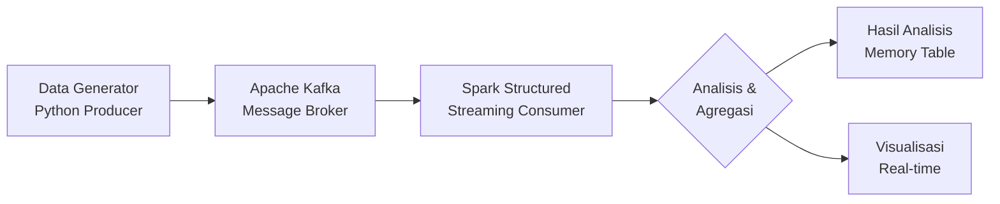

# BIG-DATA-PRAKTIKUM-7

# 🚀 Streaming Analytics dengan Kafka & Spark di Google Colab

**Praktikum Lengkap: Real-time Data Processing dengan Apache Kafka dan Spark Structured Streaming**

## 📋 Daftar Isi
- [🎯 Tujuan Praktikum](#-tujuan-praktikum)
- [🏗️ Arsitektur Sistem](#️-arsitektur-sistem)
- [🚀 Cara Menggunakan di Google Colab](#-cara-menggunakan-di-google-colab)
- [📁 Struktur Kode](#-struktur-kode)
- [🔧 Instalasi & Setup](#-instalasi--setup)
- [📊 Analisis yang Dihasilkan](#-analisis-yang-dihasilkan)
- [🧪 Tugas Praktikum](#-tugas-praktikum)
- [❓ Troubleshooting](#-troubleshooting)
- [📚 Referensi](#-referensi)

## 🎯 Tujuan Praktikum

1. **Menyiapkan lingkungan Big Data** (Spark & Kafka) di Google Colab
2. **Memahami cara mengirim data streaming** ke Kafka (Producer)
3. **Mampu memproses data real-time** menggunakan Spark Structured Streaming (Consumer)
4. **Melakukan analisis agregasi** pada data streaming
5. **Mengimplementasikan filter dan transformasi** data

## 🏗️ Arsitektur Sistem

