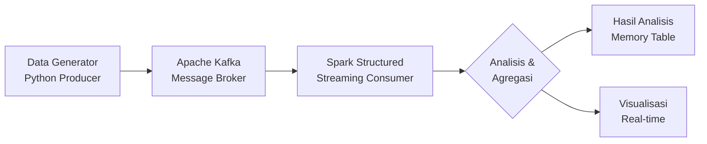

# BIG-DATA-PRAKTIKUM-7

# 🚀 Streaming Analytics dengan Kafka & Spark di Google Colab


**Praktikum Lengkap: Real-time Data Processing dengan Apache Kafka dan Spark Structured Streaming**

## 📋 Daftar Isi
- [🎯 Tujuan Praktikum](#-tujuan-praktikum)
- [🏗️ Arsitektur Sistem](#️-arsitektur-sistem)
- [📁 Struktur Kode](#-struktur-kode)
- [🔧 Instalasi & Setup](#-instalasi--setup)
- [📊 Analisis yang Dihasilkan](#-analisis-yang-dihasilkan)
- [🧪 Tugas Praktikum](#-tugas-praktikum)
- [📁 Kode Lengkap](#-kode-lengkap)

## 🎯 Tujuan Praktikum

1. **Menyiapkan lingkungan Big Data** (Spark & Kafka) di Google Colab
2. **Memahami cara mengirim data streaming** ke Kafka (Producer)
3. **Mampu memproses data real-time** menggunakan Spark Structured Streaming (Consumer)
4. **Melakukan analisis agregasi** pada data streaming
5. **Mengimplementasikan filter dan transformasi** data

## 🏗️ Arsitektur Sistem



## 📁 Struktur Kode
```python
# BAGIAN 1: PERSIAPAN LINGKUNGAN
!apt-get install openjdk-8-jdk  # Install Java
!wget https://archive.apache.org/dist/kafka/3.6.0/kafka_2.12-3.6.0.tgz  # Download Kafka
!wget https://archive.apache.org/dist/spark/spark-3.5.0/spark-3.5.0-bin-hadoop3.tgz  # Download Spark

# BAGIAN 2: KAFKA PRODUCER
from kafka import KafkaProducer
import json
import random

# BAGIAN 3: SPARK STREAMING
from pyspark.sql import SparkSession
from pyspark.sql.functions import *

# BAGIAN 4: MONITORING
query = df_analysis.writeStream \
    .outputMode("complete") \
    .format("memory") \
    .queryName("sales_table") \
    .start()

```
## 🔧 Instalasi & Setup
Dependensi yang Diinstal:
✅ Java 8 (untuk Spark & Kafka)

✅ Apache Kafka 3.6.0

✅ Apache Spark 3.5.0

✅ Python Libraries: kafka-python, findspark

Services yang Dijalankan:
Zookeeper (port 2181) - untuk koordinasi Kafka

Kafka Broker (port 9092) - message broker

Spark Session - untuk pemrosesan data

Topik Kafka yang Dibuat:
Nama: transaksi-toko

Partitions: 1

Replication: 1

## 📊 Analisis yang Dihasilkan
1. Data Transaksi Dummy
```json
{
  "transaction_id": 1,
  "product": "Laptop",
  "price": 2500000,
  "quantity": 1,
  "timestamp": "2024-01-15 14:30:00"
}

```
2. Hasil Analisis Spark
product	total_sales	total_quantity
Laptop	12,500,000	5
Mouse	1,200,000	12
Monitor	8,400,000	3

3. Metrik yang Dihitung:
✅ Total Revenue per Produk (price × quantity)

✅ Total Quantity per Produk

✅ Filter transaksi > Rp 1.000.000

✅ Sorting produk berdasarkan penjualan

## 🧪 Tugas Praktikum
Tugas 1: Tambahkan Kolom Total Quantity
```python
# MODIFIKASI: Tambah aggregation untuk quantity
df_analysis = df_with_revenue.groupBy("product") \
    .agg(
        sum("revenue").alias("total_sales"),
        sum("quantity").alias("total_quantity")  # TUGAS 1
    )
```

Tugas 2: Filter Price > 1.000.000
```python
# MODIFIKASI: Tambah filter
df_filtered = df_with_revenue.filter(col("price") > 1000000)  # TUGAS 2

Tugas 3: Output Mode Append (Opsional)
```python
# MODIFIKASI: Ubah output mode
query = df_analysis.writeStream \
    .outputMode("append") \  # TUGAS 3
    .format("memory") \
    .start()
```

## 📁 Kode Lengkap
BAGIAN 1: PERSIAPAN LINGKUNGAN (INFRASTRUKTUR)
Langkah 1: Instalasi Dependensi (Java & Python Libraries)
```python
# 1. Install Java 8 (Dibutuhkan oleh Spark & Kafka)
!apt-get install openjdk-8-jdk-headless -qq > /dev/null

# 2. Download Apache Kafka (Versi 3.6.0)
!wget -q https://archive.apache.org/dist/kafka/3.6.0/kafka_2.12-3.6.0.tgz
!tar -xzf kafka_2.12-3.6.0.tgz

# 3. Download Apache Spark (Versi 3.5.0)
!wget -q https://archive.apache.org/dist/spark/spark-3.5.0/spark-3.5.0-bin-hadoop3.tgz
!tar xf spark-3.5.0-bin-hadoop3.tgz

# 4. Install library Python untuk Kafka dan Spark
!pip install -q findspark kafka-python
```

Langkah 2: Konfigurasi Environment Variables
```python
import os

# Set Environment Variables
os.environ["JAVA_HOME"] = "/usr/lib/jvm/java-8-openjdk-amd64"
os.environ["SPARK_HOME"] = "/content/spark-3.5.0-bin-hadoop3"
os.environ["KAFKA_HOME"] = "/content/kafka_2.12-3.6.0"

# Inisialisasi Findspark agar Python bisa menemukan Spark
import findspark
findspark.init()
```

Langkah 3: Menjalankan Kafka Server (Background Process)
```python
import time

# 1. Jalankan Zookeeper (Daemon)
!nohup $KAFKA_HOME/bin/zookeeper-server-start.sh $KAFKA_HOME/config/zookeeper.properties > /dev/null 2>&1 &
print("Menunggu Zookeeper start (10 detik)...")
time.sleep(10) # Beri waktu untuk startup

# 2. Jalankan Kafka Broker (Daemon)
!nohup $KAFKA_HOME/bin/kafka-server-start.sh $KAFKA_HOME/config/server.properties > /dev/null 2>&1 &
print("Menunggu Kafka Broker start (10 detik)...")
time.sleep(10) # Beri waktu untuk startup

print("Server Kafka siap digunakan!")
```

Langkah 4: Membuat Topik Kafka
```python
# Membuat Topic 'transaksi-toko'
!$KAFKA_HOME/bin/kafka-topics.sh --create --topic transaksi-toko --bootstrap-server localhost:9092 --replication-factor 1 --partitions 1
print("Topik 'transaksi-toko' berhasil dibuat.")
```

BAGIAN 2: Simulasi Data Stream (Kafka Producer)
Langkah 5: Membuat Data Generator
```python
from kafka import KafkaProducer
import json
import time
import random
from datetime import datetime

# Fungsi untuk serialisasi data ke format JSON
def json_serializer(data):
    return json.dumps(data).encode("utf-8")

# Inisialisasi Producer
producer = KafkaProducer(
    bootstrap_servers=['localhost:9092'],
    value_serializer=json_serializer
)

# Daftar produk dummy
products = ["Laptop", "Mouse", "Keyboard", "Monitor", "HDMI Cable"]

def send_stream_data(topic_name, num_messages=50):
    print(f"Mulai mengirim {num_messages} data ke topik: {topic_name}...")
    for i in range(num_messages):
        # Membuat data transaksi palsu
        data = {
            "transaction_id": i,
            "product": random.choice(products),
            "price": random.randint(100000, 5000000),
            "quantity": random.randint(1, 5),
            "timestamp": datetime.now().strftime("%Y-%m-%d %H:%M:%S")
        }
        
        # Kirim ke Kafka
        producer.send(topic_name, data)
        
        # Simulasi jeda waktu antar transaksi (0.1 detik)
        time.sleep(0.1)
    
    print("Selesai mengirim data.")
```

BAGIAN 3: PEMROSESAN DATA (SPARK STRUCTURED STREAMING)
Langkah 6: Inisialisasi Spark Session
```python
from pyspark.sql import SparkSession

# Inisialisasi Spark dengan paket Kafka
spark = SparkSession.builder \
    .appName("KafkaSparkStreamingColab") \
    .config("spark.jars.packages", "org.apache.spark:spark-sql-kafka-0-10_2.12:3.5.0") \
    .getOrCreate()

# Set log level ke WARN untuk mengurangi output sampah di console
spark.sparkContext.setLogLevel("WARN")

print("Spark Session aktif.")
```

Langkah 7: Membaca Stream dari Kafka
```python
from pyspark.sql.functions import from_json, col
from pyspark.sql.types import StructType, StructField, StringType, IntegerType

# 1. Definisi Schema (Struktur Data JSON yang kita kirim tadi)
schema = StructType([
    StructField("transaction_id", IntegerType(), True),
    StructField("product", StringType(), True),
    StructField("price", IntegerType(), True),
    StructField("quantity", IntegerType(), True),
    StructField("timestamp", StringType(), True)
])

# 2. Read Stream dari Kafka
df_raw = spark.readStream \
    .format("kafka") \
    .option("kafka.bootstrap.servers", "localhost:9092") \
    .option("subscribe", "transaksi-toko") \
    .option("startingOffsets", "earliest") \
    .load()

# 3. Transformasi Data (Parsing JSON)
# Mengubah data binary dari Kafka menjadi kolom-kolom tabel
df_parsed = df_raw.select(
    from_json(col("value").cast("string"), schema).alias("data")
).select("data.*")

# Cek schema
df_parsed.printSchema()
```

Langkah 8: Melakukan Analisis (Agregasi)
```python
from pyspark.sql.functions import sum as _sum

# TUGAS MANDIRI 1: Tambahkan kolom untuk menghitung Total Quantity
# TUGAS MANDIRI 2: Filter transaksi dengan price > 1.000.000

# Menambah kolom 'revenue' (price * quantity)
df_with_revenue = df_parsed.withColumn("revenue", col("price") * col("quantity"))

# Filter transaksi dengan price > 1.000.000 (TUGAS 2)
df_filtered = df_with_revenue.filter(col("price") > 1000000)

# Agregasi: Group by Product dan Sum Revenue serta Sum Quantity (TUGAS 1)
df_analysis = df_filtered.groupBy("product") \
    .agg(
        _sum("revenue").alias("total_sales"),
        _sum("quantity").alias("total_quantity")  # TUGAS 1: Tambah kolom total quantity
    ) \
    .orderBy("total_sales", ascending=False)

# Untuk OPSIONAL (TUGAS 3) - output mode append
# df_analysis = df_filtered.select("product", "revenue", "quantity")
```

Langkah 9: Menjalankan Query & Visualisasi
```python
# Menulis stream ke tabel in-memory bernama "sales_table"
# Untuk TUGAS 3 OPSIONAL: Ganti "complete" dengan "append" jika tanpa agregasi
query = df_analysis.writeStream \
    .outputMode("complete") \
    .format("memory") \
    .queryName("sales_table") \
    .start()

print("Stream processing berjalan di background...")
```

BAGIAN 4: EKSEKUSI DAN MONITORING
Langkah 10: Mengirim Data & Melihat Hasil
```python
# 1. Kirim 50 data baru ke Kafka
send_stream_data("transaksi-toko", num_messages=50)

print("\n--- MENGAMBIL HASIL ANALISIS DARI SPARK ---")
# Tunggu lebih lama agar Spark punya waktu memproses
time.sleep(8)  # Ditambah dari 5 ke 8 detik

# 2. Query tabel hasil olahan Spark menggunakan SQL
result = spark.sql("SELECT * FROM sales_table")
print("=== HASIL ANALISIS PER PRODUK ===")
if result.count() > 0:
    result.show(truncate=False)
    print(f"\nJumlah produk unik: {result.count()}")
    
    # Hitung total penjualan semua produk
    total_revenue = result.agg(_sum("total_sales")).collect()[0][0]
    total_quantity = result.agg(_sum("total_quantity")).collect()[0][0]
    
    print(f"\n=== RINGKASAN KESELURUHAN ===")
    print(f"Total Revenue Semua Produk: Rp {total_revenue:,}")
    print(f"Total Quantity Semua Produk: {total_quantity} unit")
    
    # Produk terlaris
    best_seller = result.orderBy("total_sales", ascending=False).first()
    print(f"\nProduk Terlaris: {best_seller['product']}")
    print(f"Revenue Produk Terlaris: Rp {best_seller['total_sales']:,}")
else:
    print("Belum ada data yang diproses. Tunggu beberapa detik dan coba lagi.")

# 3. Untuk melihat data mentah yang sudah difilter (tugas optional)
print("\n=== DATA TRANSAKSI MENTAH (Sample) ===")
# Ambil sample data streaming dengan limit
sample_query = df_filtered.writeStream \
    .outputMode("append") \
    .format("memory") \
    .queryName("sample_filtered") \
    .start()

time.sleep(2)  # Tunggu sebentar

# Ambil 10 data sample
sample_data = spark.sql("SELECT * FROM sample_filtered LIMIT 10")
print("10 transaksi terbaru (harga > 1 juta):")
sample_data.show(truncate=False)

# Hentikan query sample
sample_query.stop()
sample_count = spark.sql("SELECT COUNT(*) FROM sample_filtered").collect()[0][0]
print(f"Total transaksi > 1 juta dalam sample: {sample_count}")

# Hapus tabel temporary
spark.catalog.dropTempView("sample_filtered")
```
